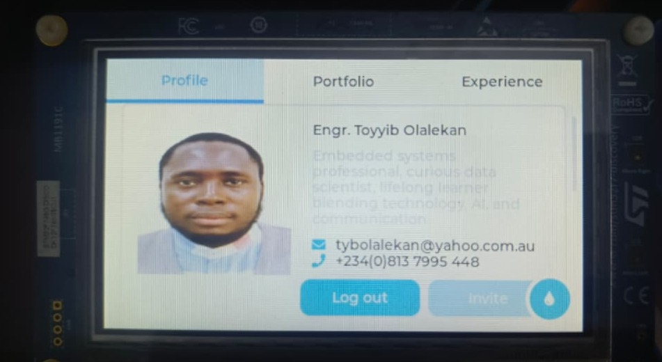

# Contact_Card_LVGL

## Overview

**Contact_Card_LVGL** is a simple embedded GUI project built with **LVGL
(Light and Versatile Graphics Library)**.\
It displays a digital contact card containing a passport photo, name,
professional summary, email address, and phone number.

This project is designed as a clean UI showcase for LVGL on embedded
systems and can be adapted for portfolios, demo devices, or personal
branding on hardware displays.

## Features

-   Passport/profile image display\
-   Name and professional summary section\
-   Contact details (email and phone number)\
-   Clean and minimal LVGL-based UI\
-   Easily customizable content and layout

## Technologies Used

-   **LVGL** (Light and Versatile Graphics Library)\
-   C / C++ (depending on platform integration)\
-   Embedded hardware (ESP32, STM32, or similar)

## Use Cases

-   Embedded UI portfolio showcase\
-   Demo application for LVGL learning\
-   Personal digital business/contact card\
-   UI testing on embedded displays

## Getting Started

1.  Clone the repository:

    ``` bash
    https://github.com/tybolalekan/Contact_Card_LVGL.git
    ```

2.  Integrate the project into your LVGL-supported platform.

3.  Configure display and input drivers as required.

4.  Build and flash to your target device.

## Customization

You can easily customize: - Profile image\
- Text content (name, bio, email, phone)\
- Fonts, colors, and layout\
by editing the LVGL widget definitions in the source files.

## Screenshots



## License

This project is open-source and available under the MIT License.

------------------------------------------------------------------------

Feel free to fork, modify, and improve this project.

